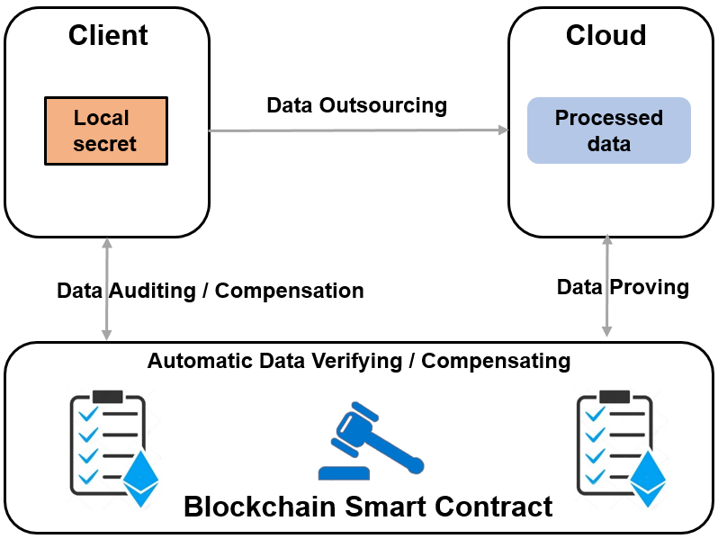

# Blockchain enabled cloud storage auditing for automatic user compensation

With the large-scale application of cloud storage services, the security of stored data is valued by individuals and companies.
To enhance outsourced data security, cloud storage auditing protocols to verify the integrity of the data without downloading all the data.

## What we do


To sole the usability issue, we propose an efficient smart-contract-based cloud storage auditing protocol.
The protocol only requires one signature verification that is natively supported by Ethereum, which makes the proposed protocol very efficient.
The proposed protocol also supports automatic user compensation.

## Usage
### Installation
Our project code is written in golang, make sure you have version 1.19 of golang on your computer. You can download the code by git clone. Run the command line as shown below.

```text
git clone https://github.com/szu-security-group/cloud-storage-auditing-automatic-compensation.git
cd ${your_path}$
go run .

```

### Project layout
Let's briefly introduce the layout of the project. 
```text
contracts
    autoPay.sol
    SolRsaVerify.sol
core
    autoPA.go
    utils.go
data
    data.go
main.go
```

The `main.go` is a complete demo of the protocol.

`contract` contains the solidity files of the smart contract. 

`core\autoPA.go` includes each algorithm of the protocol. 

`data` are simple data processing methods collection.

### Deploy contract
Because of the differences in contract deployment, some difficult problems may arise. We only provide the source code of the contract, and the guidance for deploying the contract is beyond the scope of this discussion.

We still provide two methods for you to test the contract, the first one is `remix online compiler`. You can push files in `contract` to `remix` and deploy it and call the function easy. The operational details of the protocol can be clearly displayed, such as gas cost.

The second method is slightly more complicated. You can use `api` way to make your go program connect to blockchain and run the function. `Rinkeby` is a public test blockchain and `Ganache` is a private personal test blockchain platform. You can create a wallet through `MetaMask`, and then deploy smart contracts on blockchain and test the operation of the protocol and its performance.

